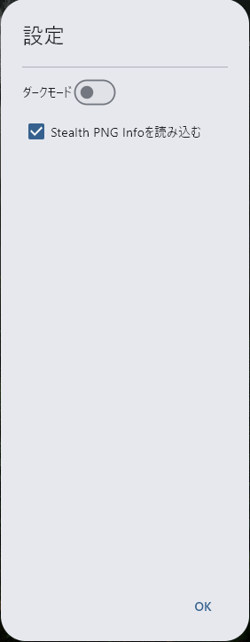
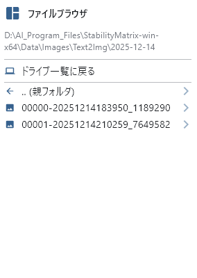
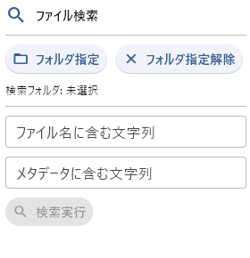
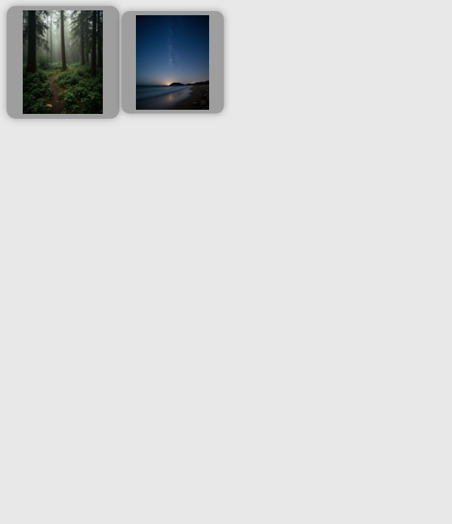
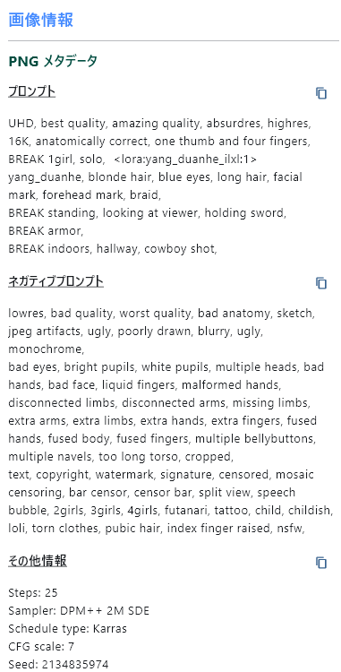

# PNG Image Viewer with Metadata

## 動作条件
Windows 11  
python 3.14 (でしか動作確認していません)
## セットアップ方法
以下いずれかの方法でセットアップしてください。
### 1. pythonスクリプトのまま利用する
`start.bat` を実行するとpythonスクリプトをそのまま実行します。
### 2. EXE化して利用する
`deploy.bat` を実行すると、distディレクトリに `PNGImageViewerWithMetadata.exe` が出来上がります。  
お好きな場所に持って行ってexeを実行してください。
## 使い方
### 左ペイン
#### 設定

- ダークモード
  - トグルスイッチでテーマを切り替えます。
  - デフォルト：OFF(ライトテーマ)
- Stealth PNG Infoを読み込む：
  - 画像を選択して表示する際のメタデータ取得においてStealth PNG Infoを読み込みます。
  - OFFにするとStealth PNG Infoを探しにいかなくなるので画像の読み込みが早くなります。
  - デフォルト：ON

下部のOKボタンで閉じます。
#### 閲覧モード
  
Windowsのエクスプローラーに似たファイルリストが表示されます。  
移動　　：左クリック  
履歴移動：マウスの進む/戻る  
表示更新：再度閲覧モードのボタンを左クリック  

また、直前に見ていた場所を記憶しており、次回の起動時や検索モードから切り替えた際に状態を再現します。
#### 検索モード
  
ディレクトリを指定して、ファイル名およびメタデータに対して検索ができます。
- サブディレクトリは再帰的に検索します。  
(ゆえにドライブ直下等を指定すると大変なことになります…)
- 大文字/小文字の区別はしません。
- 正規表現での検索は対応していません。
- 検索中やサムネイル表示途中にクリックすると中断できます。

また、閲覧モードから切り替えた際は直前の検索結果を復元しますが、前回起動時に最後に検索した内容は記憶していません。  
検索中断後に閲覧モードに切り替えてから戻ってきた場合も、再検索は行いません。
### 中ペイン
  
中ペインにはサムネイル表示および選択画像の表示がされます。  
#### 閲覧モード
ファイルブラウザ側でPNG画像のあるディレクトリに移動すると、サムネイル表示がされます。  
サムネイルをクリックすることや、ファイルブラウザから直接画像を選択することで画像1枚を大きく表示できます。  
#### 検索モード
検索条件に一致したものがあるとサムネイル表示がされます。  
サムネイルをクリックすることで画像1枚を大きく表示できます。  
#### 右クリックメニュー
  
表示された1枚の画像を右クリックすると専用のメニューが現れます。
- クリップボードにコピー
  - 透明度の有無を選べます。
  - 透明度のある画像を透明度なしでコピーした場合、透明な部分は白になります。
- メタデータを消去した状態で保存する
  - 本スクリプト直下のoutputディレクトリに_cleanedというファイル接尾語が付与されて保存されます。
  - 通常のメタデータのほか、アルファ値に埋め込まれているプロンプトも消えます。
  - その際に同名のファイルがあった場合は上書きされます。
- この画像のフォルダをWindowsのエクスプローラで開く
  - 表示中の画像が選択された状態でWindowsのエクスプローラが立ち上がります。

### 右ペイン：ファイル情報(メタデータ)
  
ここには画像をクリックした際にメタデータなどが表示されます。  
対応しているメタデータの種類はtEXt、iTXt、zTXtです。  
Stable Duffusion WebUIで生成された画像については
- ポジティブプロンプト
- ネガティブプロンプト
- その他情報

というように表示され、それぞれクリップボードへのコピーボタンが表示されます。  
オプション設定でStealth PNG Infoを読み込むようにしていた場合、かつ画像にStealth PNG Infoが存在する場合は追加で内容が表示されます。  
なお、ComfyUIで作成された画像については非対応です。メタデータの生の値が表示されます。  

## Q&A
### Q. なんでこんなもん作ったの？
A. AIにコーディングさせたらどうなるのかという実験目的。なかなかに楽しい。  
　 あえてコーディングにはあまり向いていないといわれるGrokにやらせている。(2025/12現在 4.1 beta)
### Q. Stealth PNG Infoの検索には対応しないの？
A. 恐ろしく処理が重くなるのでしません。